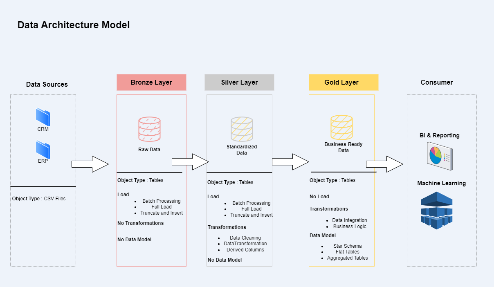

# Data Warehouse with Medallion Architecture

End-to-end data engineering project implementing a **medallion architecture (bronze-silver-gold)** in SQL Server. Features automated ETL pipelines, comprehensive exploratory data analysis (EDA), and advanced analytics for business intelligence.

## Architecture Overview
- **Bronze Layer**: Raw ingestion of source data via stored procedures (landing zone with minimal transformation)
- **Silver Layer**: Cleaned, validated data with business logic applied (stored procedures for transformations)
- **Gold Layer**: Analysis-ready star schema for reporting (views with optimized dimensions/facts)

### EDA Highlights
1. **Dimensional Analysis**  
   - Customer demographics (geographic distribution, age segmentation)
   - Product hierarchy analysis (category/subcategory performance)
2. **Temporal Trends**  
   - Sales performance over time (YOY/MOM trends)
   - Customer lifetime value calculation
3. **Advanced Analytics**  
   - Product performance benchmarking
   - Customer segmentation (VIP/Regular/New)
   - Revenue contribution analysis (part-to-whole)
     
## Key Features
- **Idempotent Stored Procedures** for reliable incremental loading
- **Star Schema** in Gold layer for BI tool consumption
- **Data Validation** at Silver layer
- **Parameterized Scripts** for environment flexibility

## Setup
1. Execute bronze/silver stored procedures in dependency order
2. Create gold views after silver transformations

## Data Architecture

*Medallion architecture workflow: Bronze → Silver → Gold*

